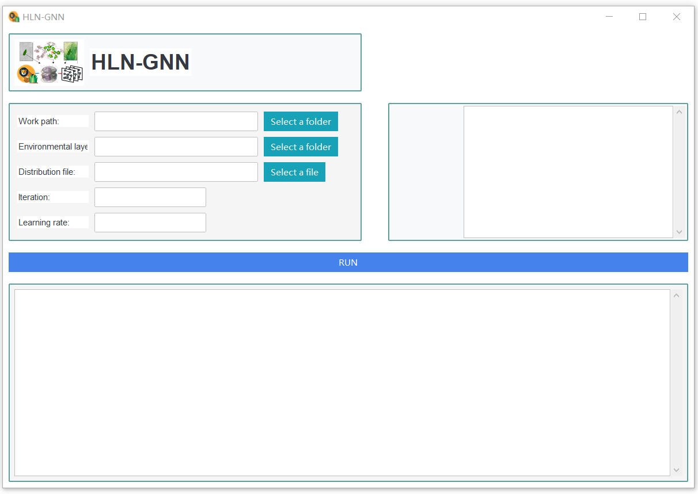
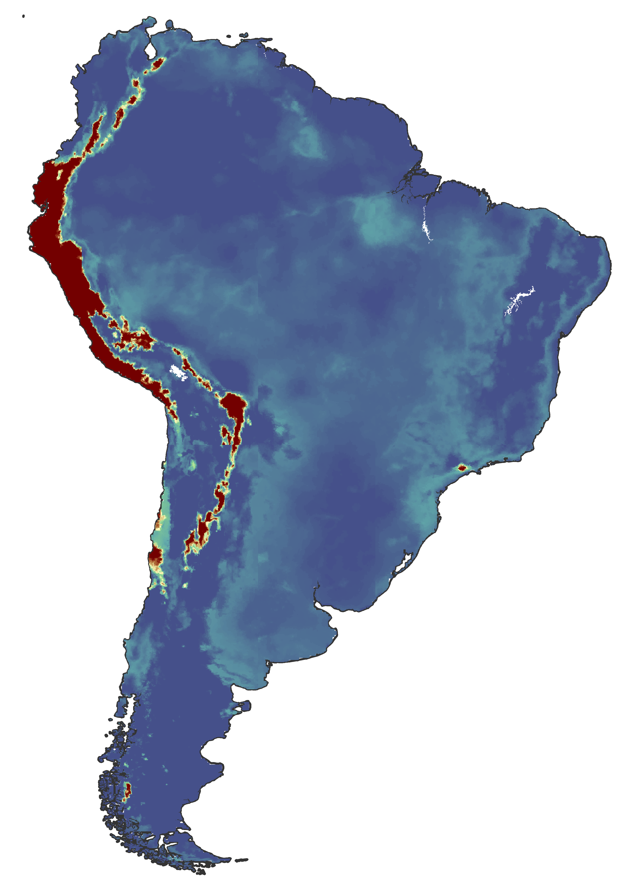

# Heterogeneous Landscape Network-based Graph Neural Network (HLN-GNN)

HLN-GNN is a habitat suitability prediction framework based on complex patch networks and graph neural networks. HLN-GNN operates on patch matrices generated through environmental layer clustering. This approach represents diverse ecological patches as an interactive network, then extracts knowledge from known species distribution ranges to predict suitability probabilities in unexplored areas.

The entire process consists of four parts: species distribution data input, patch network construction, GNN-based feature extraction and model training, and suitability probability prediction for undeveloped regions. By integrating niche theory into graph neural networks (GNNs), HLN-GNN can identify ecological patterns that traditional species distribution models (SDMs) often fail to detect.

## HLN-GNN Software (version 1.0)

To apply HLN-GNN, you need to follow these two steps:

### 1. Generate Ecological Patch Matrices through an Unsupervised Clustering Process

Run the `1Aggregate_patches.R` script to generate patch matrices within the specified study area. For detailed instructions, refer to `Tutorial_step1_Generate_patch_matrix.pdf`.

### 2. Predict Habitat Suitability Using HLN-GNN

Run `dist\HLNGNN\HLNGNN.exe` to predict the distribution of habitat suitability based on the species range polygon. For detailed instructions, refer to `Tutorial_step2_Predict_the_suitability_probability_by_HLN_GNN.pdf`.

## HLN-GNN interface

## Predicting habitat suitability by HLN-GNN

