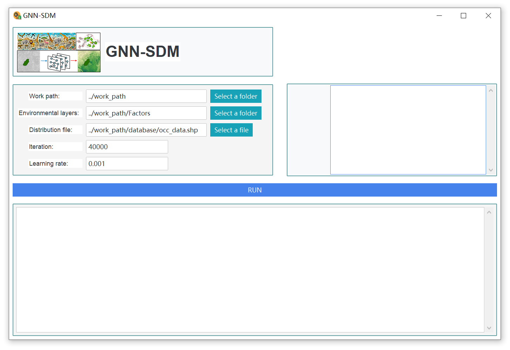

# Graph Neural Network-based Species Distribution Model (GNN-SDM)

GNN-SDM (Graph Neural Network-based Species Distribution Model)：
This framework is a species distribution modeling framework that uses spatial polygon data representing species distribution ranges as input and incorporates landscape patches to account for complex environmental features and landscape patterns. 

## GNN-SDM workflow
GNN-SDM is a framework for species distribution modeling that leverages spatial polygon data representing known species ranges and information extracted from heterogeneous landscape patches. This method predicts the probability of species occurrence or habitat suitability by incorporating both the structure and contextual information of landscape patches within a species’ known distribution range. The process begins by representing the terrestrial environment as a landscape patch matrix composed of patches of varying sizes and shapes, using a method called Self-Organizing Map (SOM). These patches serve as ecologically homogeneous units that better capture the spatial patterns of the landscape. By establishing adjacency relationships among these patches and constructing an adjacency matrix, the environmental rasters are transformed into a patch-based graph network. This graph supports the integration of a Graph Neural Network (GNN) into the species distribution modeling framework. GNN-SDM enables the propagation of information across connected patches, allowing the model to learn how species respond to specific ecological landscapes and improving the ecological expressiveness of predictions.

Species often rely on distinct habitat patches to perform key biological processes such as foraging, reproduction, sheltering, and dispersal. These diverse combinations of patch functions reflect the target species’ specific ecological requirements. Within this framework, patches located inside the species’ known range are encoded as “presence” patches, representing occurrences. These patches are assumed to contain the critical resources necessary for the species’ survival. Using the labeled “presence” patches, their environmental features, and the adjacency matrix, a GNN model is trained to learn the species’ habitat preferences. Finally, the trained model is applied to all patches across the study area to predict the probability of species presence or the habitat suitability score for each patch.

## GNN-SDM Program (version 1.0)

There are two steps required to apply GNN-SDM:

### 1. Generate a landscape patch matrix using an unsupervised clustering algorithm.

Run the `step_1 Generate landscape patch.R` script to generate a landscape patch matrix within the defined study area. For detailed instructions, please refer to the `GNNSDM_Tutorial.pdf`.

### 2. Species distribution modeling using GNN-SDM

Run `GNN_SDM.exe` to predict habitat suitability or distribution probability for species based on range polygon data, which can be obtained from the IUCN Red List website (https://www.iucnredlist.org/). For detailed instructions, please refer to `GNNSDM_Tutorial.pdf`.

## GNN-SDM interface

The GNN-SDM program with a graphical user interface, along with its source code, is available at the following link:
https://drive.google.com/drive/folders/19_MSaooZRyuKxvo2xaAWDi25_fSB7flJ?usp=sharing

## Predicting habitat suitability by GNN-SDM

